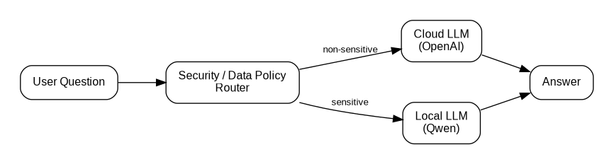
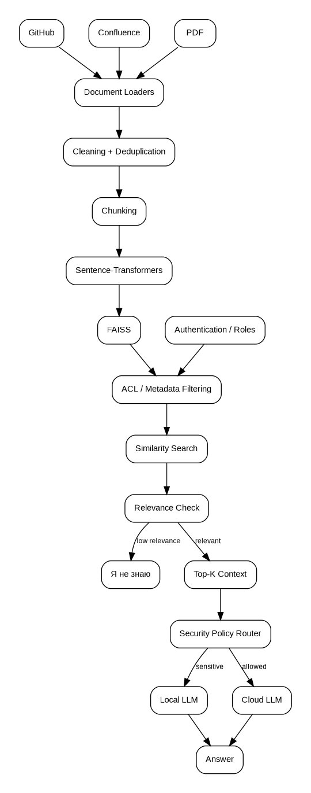

# Задание 1. Исследование моделей и инфраструктуры

## 1. Вводные данные и критерии выбора

QuantumForge Software планирует создать внутреннего RAG-бота для поиска информации в корпоративной базе знаний.

Объём исходных данных:

- около 18 000 Markdown/MDX-файлов;
- около 3 000 страниц Confluence;
- около 250 PDF-документов;
- прирост — около 400 страниц в месяц.

Основные пользователи системы — разработчики, техническая поддержка, менеджеры, аналитики и новые сотрудники.

При выборе архитектуры используются следующие критерии:

- качество retrieval и generation;
- скорость ответа и индексации;
- стоимость владения и эксплуатации;
- конфиденциальность корпоративной информации;
- сложность развёртывания и сопровождения;
- масштабируемость;
- совместимость с существующей AWS-инфраструктурой компании.

Часть документации может содержать внутренние архитектурные решения, сведения об инфраструктуре, конфигурациях клиентов и другие чувствительные данные. Поэтому целевая архитектура должна позволять разделять обычные и конфиденциальные запросы и не передавать чувствительные фрагменты внешнему LLM-провайдеру без разрешения.

---

## 2. Сравнение LLM-моделей

Для исследования рассмотрены три варианта:

1. локальная open-source LLM из Hugging Face, например `Qwen/Qwen3-8B`;
2. облачные модели OpenAI;
3. YandexGPT.

| Критерий | Локальная Hugging Face LLM | OpenAI | YandexGPT |
|---|---|---|---|
| Качество ответов | Хорошее при качественном retrieval; зависит от выбранной модели | Высокое качество генерации и reasoning | Хорошее качество, особенно для русскоязычных сценариев |
| Английская техническая документация | Хорошо | Очень хорошо | Поддерживается, но русский язык является важным сценарием использования |
| Скорость | Зависит от GPU, размера модели и batching | Высокая, инфраструктура провайдера | Высокая, инфраструктура провайдера |
| Стоимость запроса | Нет оплаты за токены | Оплата за токены | Оплата за токены |
| Постоянные затраты | Сервер, GPU, эксплуатация | Практически отсутствуют | Практически отсутствуют |
| Развёртывание | Наиболее сложное | Простое API | Простое API |
| Масштабирование | Нужно организовывать самостоятельно | Выполняет провайдер | Выполняет провайдер |
| Конфиденциальность | Максимальный контроль | Требуется корпоративная политика обработки данных | Требуется корпоративная политика обработки данных |
| Vendor lock-in | Низкий | Средний/высокий | Средний/высокий |

### 2.1. Локальная LLM

Локальная модель даёт максимальный контроль над данными: запрос пользователя и найденные фрагменты документации могут обрабатываться внутри инфраструктуры QuantumForge.

Для RAG-системы модель класса 7–14B может быть достаточной, поскольку знания поступают из retrieval-контекста, а LLM в основном формирует ответ на основе найденных документов.

Основной недостаток — необходимость собственной inference-инфраструктуры: GPU, model serving, batching, autoscaling, мониторинг и обновление моделей.

### 2.2. OpenAI

OpenAI позволяет быстро построить MVP без собственной GPU-инфраструктуры. В API отправляется не вся база знаний, а только запрос пользователя и несколько релевантных фрагментов, найденных retrieval-слоем.

Для QuantumForge важным условием остаётся политика классификации данных: даже при использовании корпоративных механизмов защиты не любой документ автоматически разрешено передавать внешнему сервису.

### 2.3. YandexGPT

YandexGPT также позволяет отказаться от собственной GPU-инфраструктуры и имеет простой API.

Для QuantumForge этот вариант менее естественен с инфраструктурной точки зрения, поскольку production-среда компании уже построена вокруг AWS. Кроме того, качество необходимо отдельно проверять на англоязычной технической документации компании.

### Вывод по LLM

Для учебного MVP рационально использовать облачную LLM из-за простоты развёртывания и высокой скорости старта.

Для целевой корпоративной архитектуры рекомендуется гибридный подход: обычные запросы можно направлять в облачную LLM, а чувствительные — в локальную модель.



---

## 3. Сравнение моделей эмбеддингов

Рассматриваются:

- локальные Sentence-Transformers;
- OpenAI Embeddings.

В качестве кандидата для экспериментального сравнения выбрана модель:

```text
sentence-transformers/multi-qa-mpnet-base-cos-v1
```

Она предназначена для semantic search и подходит для сценария, где короткий запрос пользователя сопоставляется с более длинными фрагментами документации.

| Критерий | Sentence-Transformers | OpenAI Embeddings |
|---|---|---|
| Где выполняется | Локально | API OpenAI |
| Стоимость API | Нет | За количество токенов |
| Требования к серверу | CPU или GPU | Минимальные |
| Скорость индексации | Высокая на GPU, приемлемая на CPU | Высокая, но зависит от сети и API limits |
| Конфиденциальность | Данные не покидают инфраструктуру | Текст отправляется API-провайдеру |
| Качество | Зависит от выбранной модели | Высокое и стабильное |
| Настройка | Можно менять и дообучать модели | Модель управляется провайдером |
| Vendor lock-in | Низкий | Есть |

### Стоимость первичной индексации

Стоимость облачных embeddings для текущего объёма данных невелика.

Если после preprocessing и chunking база содержит условно 20 млн токенов, то при цене $0.02 за 1 млн токенов расчёт составит:

```text
20 × $0.02 = $0.40
```

Это пример: точное количество токенов нужно определить после загрузки и chunking реальной базы.

### Вывод по embeddings

Для MVP выбран локальный Sentence-Transformers, потому что:

- embeddings корпоративных документов создаются внутри инфраструктуры;
- нет стоимости повторной переиндексации;
- отсутствует зависимость от внешнего API;
- текущий объём базы достаточно небольшой для локальной обработки;
- embedding-модель можно заменить без изменения общей архитектуры RAG.

Выбор необходимо подтвердить экспериментом на 50–100 реальных вопросах сотрудников. Для сравнения моделей можно использовать:

- Recall@K;
- MRR;
- Hit Rate@K;
- nDCG@K.

---

## 4. Сравнение FAISS и ChromaDB

FAISS — библиотека для эффективного similarity search по плотным векторам. Это не полноценная БД, а векторный индекс, который можно встроить непосредственно в приложение.

ChromaDB — полноценное векторное хранилище, которое умеет хранить embeddings, документы и metadata, а также поддерживает фильтрацию по metadata и отдельный server mode.

| Критерий | FAISS | ChromaDB |
|---|---|---|
| Тип | Векторный индекс / библиотека | Vector database |
| Vector search | Да | Да |
| Metadata | Нужно организовывать отдельно | Встроено |
| Metadata filtering | Ограниченно / вручную | Есть |
| Persistence | Контролируется приложением | Встроено |
| Отдельный сервис | Не требуется | Возможен |
| Скорость и overhead | Минимальный overhead | Выше из-за дополнительного слоя БД |
| Простота MVP | Очень высокая | Высокая |
| Масштабирование | Реализуется приложением | Есть варианты client-server и distributed |
| Стоимость лицензии | Бесплатно | Бесплатно для OSS |
| Инфраструктурная стоимость | Минимальная | Выше, если используется отдельный сервис |

### Выбор для проектной работы

Для MVP и выполнения проектной работы выбран **FAISS**.

Причины:

1. текущий объём данных не требует распределённой vector database;
2. FAISS имеет минимальную инфраструктурную сложность;
3. не нужен отдельный database server;
4. он хорошо интегрируется с LangChain;
5. подходит для демонстрации полного RAG pipeline.

При этом FAISS не рассматривается как безусловный production-выбор. Если в дальнейшем появятся требования к сложной metadata-фильтрации, ACL, большому количеству коллекций или независимому lifecycle индекса, выбор следует пересмотреть в пользу полноценной vector database, например ChromaDB или другого специализированного решения.

---

## 5. Рекомендуемая серверная конфигурация

Требования к серверу зависят от того, используется облачная или локальная LLM.

### 5.1. Вариант с облачной LLM

| Ресурс | Рекомендуемая конфигурация |
|---|---|
| CPU | 4–8 vCPU |
| RAM | 16–32 GB |
| GPU | Не требуется |
| SSD | 100 GB+ |
| ОС | Linux |
| Контейнеризация | Docker / Kubernetes |

Этого достаточно для API бота, LangChain, Sentence-Transformers, FAISS и обработки документов.

Для первичной массовой индексации локальной embedding-моделью можно временно использовать GPU.

### 5.2. Вариант с локальной LLM

| Ресурс | Рекомендуемая конфигурация |
|---|---|
| CPU | 16 vCPU |
| RAM | 64 GB |
| GPU | NVIDIA GPU с 24 GB VRAM |
| SSD | 200 GB NVMe |
| ОС | Linux |
| LLM server | vLLM / аналог |
| Контейнеризация | Docker / Kubernetes |

Для quantized 7–8B модели 24 GB VRAM дают разумный запас. Для моделей порядка 14B, большого контекста или высокой параллельности следует рассматривать GPU с 48 GB VRAM.

---

## 6. Варианты решения

| Вариант | LLM | Embeddings | Vector Store | Конфиденциальность | Сложность эксплуатации | Основной сценарий |
|---|---|---|---|---|---|---|
| A. Cloud | OpenAI | OpenAI | FAISS | Средняя | Низкая | Быстрый MVP |
| B. Local | Qwen3-8B | Sentence-Transformers | FAISS | Высокая | Высокая | Чувствительные данные |
| C. Yandex Cloud | YandexGPT | Cloud / local | FAISS / ChromaDB | Средняя | Средняя | Если выбран Yandex Cloud |
| D. Hybrid | OpenAI + local Qwen | Sentence-Transformers | FAISS | Высокая | Средняя | Целевая архитектура QuantumForge |

### Вариант A — полностью облачный

Плюсы: минимальное время разработки, нет собственной GPU-инфраструктуры, высокая скорость старта.

Минусы: данные отправляются внешнему провайдеру, есть зависимость от API и оплаты за токены.

### Вариант B — полностью локальный

Плюсы: максимальный контроль над данными, отсутствие оплаты за токены, низкий vendor lock-in.

Минусы: необходим GPU и более сложная эксплуатация.

### Вариант C — Yandex Cloud

Плюсы: простое API, отсутствие собственной GPU-инфраструктуры.

Минусы: дополнительный облачный провайдер рядом с существующим AWS и необходимость отдельного benchmark на англоязычной технической документации.

### Вариант D — гибридный

Сочетает облачную LLM для разрешённых данных и локальную LLM для чувствительных документов.

Документы предварительно получают security-классификацию, например:

```text
PUBLIC
INTERNAL
CONFIDENTIAL
RESTRICTED
```

Это позволяет не передавать чувствительный контекст внешнему провайдеру.

---

## 7. Итоговая рекомендация

### MVP

**Векторное хранилище — FAISS.**

FAISS выбран благодаря минимальной инфраструктурной сложности и достаточной функциональности для текущего объёма данных и учебной реализации RAG.

### Целевая корпоративная архитектура

Для production-системы рекомендуется гибридная архитектура:

- локальные embeddings;
- retrieval по корпоративной базе;
- обязательная фильтрация по ACL/ролям до выдачи контекста;
- проверка релевантности найденных фрагментов;
- ответ «Я не знаю», если релевантного контекста недостаточно;
- маршрутизация разрешённых запросов в cloud LLM;
- маршрутизация чувствительных запросов в local LLM.



Такое решение:

- сокращает время поиска информации;
- позволяет отвечать только на основании корпоративной базы знаний;
- поддерживает честный ответ «Я не знаю»;
- не требует сложной vector database на этапе MVP;
- поддерживает постепенное масштабирование;
- учитывает конфиденциальность и разграничение доступа;
- не создаёт жёсткой зависимости между retrieval-слоем и конкретной LLM.

В дальнейшем FAISS можно заменить на ChromaDB или другое специализированное векторное хранилище без изменения общей логики RAG pipeline.